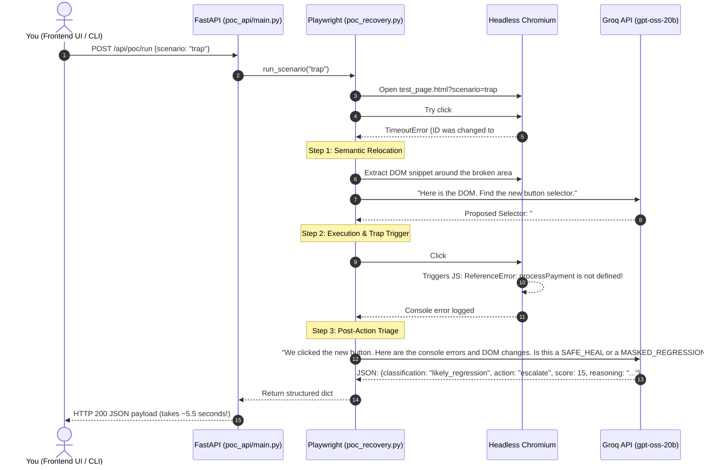

# TriageCore: First-Principles Explainer & Proposal Defense Guide

> **Purpose of this guide:**  
> Read this document from top to bottom. It breaks down TriageCore into plain English using first principles. No buzzword fluff, no academic jargon. After reading this, you will understand exactly what we are building, why it matters, how our POC works, and how to defend it with total confidence in front of any faculty panel.

---

## Table of Contents
1. [The Big Picture: What Problem Are We Solving?](#1-the-big-picture-what-problem-are-we-solving)
2. [The Hidden Trap: Why Existing "AI Self-Healing" Tools Fail](#2-the-hidden-trap-why-existing-ai-self-healing-tools-fail)
3. [Our Solution: What Is TriageCore?](#3-our-solution-what-is-triagecore)
4. [Why Two Agents (QA + CI)? The "Triage" Metaphor](#4-why-two-agents-qa--ci-the-triage-metaphor)
5. [What Makes This a Complex Computing Problem (CCP)?](#5-what-makes-this-a-complex-computing-problem-ccp)
6. [The "AI-Resilience" Defense: Why This Isn't Just an LLM Wrapper](#6-the-ai-resilience-defense-why-this-isnt-just-an-llm-wrapper)
7. [How Our Proof of Concept (POC) Works Under the Hood](#7-how-our-proof-of-concept-poc-works-under-the-hood)
8. [The UI Explained: What Is Live vs. What Is Target Architecture](#8-the-ui-explained-what-is-live-vs-what-is-target-architecture)
9. [The 5-Minute Proposal Defense Script (Word-for-Word Pitch)](#9-the-5-minute-proposal-defense-script-word-for-word-pitch)
10. [Top 5 Toughest Panel Questions & Bulletproof Answers](#10-top-5-toughest-panel-questions--bulletproof-answers)

---

## 1. The Big Picture: What Problem Are We Solving?

Every modern software company runs **automated tests** on every code push before shipping to customers.

Here is how automated UI testing works today:
1. A developer writes an automated script (e.g. using Playwright or Cypress) that says:  
   *“Open the web page, find the button with `id="submit-order-btn"`, and click it.”*
2. Tomorrow, a frontend developer refactors the button's HTML and changes the ID to `id="checkout-btn"`.
3. The test runs in the pipeline. It looks for `id="submit-order-btn"`. It can't find it.
4. **The test crashes and turns the pipeline RED.**

Did the web app break? **No!** The web app works perfectly. The customer could have checked out fine. But the *test broke* because the selector was stale.

This is called **Test Flakiness & Stale Selectors**. Software engineering teams spend up to **30% of their engineering time** manually fixing broken selectors and babysitting CI pipelines.

---

## 2. The Hidden Trap: Why Existing "AI Self-Healing" Tools Fail

Over the past two years, tools like Healenium or AI browser agents emerged saying:  
> *“Hey, if a selector breaks, don’t fail the test! Use an LLM or computer vision to find the button, click it, and heal the test automatically!”*

**This sounds great, but it introduces a fatal, dangerous flaw: Masked Regressions.**

Imagine this scenario:
1. A developer refactors the Checkout page.
2. They accidentally introduce a bug in the button's Javascript `onclick` handler (e.g. a broken function call or a missing payment token).
3. The automated test runs. The old selector fails.
4. The "blind" AI self-healing tool kicks in. It inspects the DOM, finds the new button, and clicks it.
5. In the browser background, an uncaught Javascript `ReferenceError` explodes! The payment never processes.
6. But because the AI found a button and clicked it without throwing a Playwright timeout, the naive tool says:  
   *“Self-heal successful! Test Passed! All green!”*
7. **The pipeline merges the broken code into production. Real users cannot checkout. The business loses money.**

> **The Core Insight of TriageCore:**  
> **Blind self-healing is worse than failing.** A failed test annoys a developer; a falsely passed test ships broken software to production.

---

## 3. Our Solution: What Is TriageCore?

TriageCore does **not** assume a heal is safe just because a click succeeded.

When a selector breaks:
1. It uses an LLM to semantically relocate the element in the DOM and clicks it.
2. **Crucially, it captures post-click execution aftermath evidence:**
   - Did the DOM actually reach the expected state (e.g., did an order confirmation appear)?
   - Did the browser console log uncaught Javascript errors?
   - Did background API network calls return 500 status codes?
3. It passes all this evidence to a specialized **Confidence-Scoring Engine**.
4. The engine outputs a **score (0 to 100)** and a **decision**:
   - **`SAFE_HEAL` / `heal`:** If the click executed cleanly and the application moved to the expected state.
   - **`MASKED_REGRESSION_ESCALATED` / `escalate`:** If the click triggered an error or failed to progress state. The system **aborts the auto-heal** and alerts a human engineer.

---

## 4. Why Two Agents (QA + CI)? The "Triage" Metaphor

**"Triage"** is a medical emergency room term. When 20 injured patients arrive, the triage doctor doesn't treat everyone at once. They decide:
- Who needs immediate surgery?
- Who can be patched with a band-aid?
- Who just needs to rest?

In software development pipelines, failures happen in two places:
1. **The QA Agent (Browser UI Tests):** A test step fails while running in Playwright.
2. **The CI Reliability Agent (GitHub Actions Builds):** A build or test run fails in GitHub Actions CI logs.

### Are these two different projects? NO.
They are **two applications of the exact same mathematical decision problem**:
$$\text{Given noisy, incomplete failure evidence } \rightarrow \text{ Can the system act autonomously, or must it call a human?}$$

| Pipeline Stage | Noisy Raw Evidence | Autonomous Action (High Confidence) | Escalation Action (Low Confidence / Dangerous) |
| :--- | :--- | :--- | :--- |
| **QA Agent (Browser)** | Stale selector + Post-click DOM & console logs | Auto-heal selector & update test script | **Escalate to QA engineer** (prevent masked bug) |
| **CI Agent (GitHub)** | Raw build logs + Commit git-blame history | Auto-generate fix PR (e.g. dependency bump) | **Escalate to developer** (flag ambiguous commit/bug) |

**TriageCore is the shared Brain (the `ConfidenceEngine`) that sits between both agents.**

---

## 5. What Makes This a Complex Computing Problem (CCP)?

When the FAST faculty panel asks: *"Why is this a Complex Computing Problem under the Seoul Accord?"*, do not give vague answers. Give these 4 specific characteristics:

1. **Conflicting Technical Requirements (Speed vs. Correctness):**
   - You want tests to heal autonomously and pipelines to unblock automatically (speed).
   - But an autonomous action has severe negative consequences if wrong (masking a bug or merging a bad fix).
   - Balancing autonomous execution vs. safety under a tight latency budget ($<10\text{s}$) is non-trivial.
2. **No Obvious Solution (Diagnosis Under Incomplete & Noisy Information):**
   - From the surface failure alone (e.g., `Timeout: element not found`), you cannot know whether it is a cosmetic rename or a breaking code refactor.
   - A simple `if-else` or single regex cannot solve this. You must correlate multi-modal telemetry: DOM tree hierarchies, role semantics, asynchronous console event streams, and network requests.
3. **Ill-Defined Root Cause:**
   - In CI failures, 5 commits were pushed in a single pull request. Logs are noisy, truncated, and full of irrelevant warnings. Tracing the failure back to the specific offending line of code across commit diffs is an open diagnostic challenge.
4. **Significant Consequences:**
   - Unlike a toy chatbot where a hallucination is harmless, an incorrect decision here ships regressions to production or blocks engineering deployments.

---

## 6. The "AI-Resilience" Defense: Why This Isn't Just an LLM Wrapper

This is the **#1 question FAST panel evaluators ask** in 2026:
> *"You're just calling Groq or ChatGPT to find the button and read the error. Any student can write a prompt in 10 minutes. What did YOU build?"*

### Your Answer (The "External Dependency" Classification):
Point to **Section 14 of the FAST Idea Selection Guide**:

1. **The LLM is Core-Assist, NOT Core-Replacement:**
   - The LLM's only job is reasoning over messy, unstructured strings (parsing raw HTML chunks and log traces).
   - **The LLM does NOT make the final decision to heal or escalate.**
2. **What WE built (The Student IP):**
   - **The `ConfidenceEngine` & Mathematical Weighting (`weights.yaml`):**  
     A deterministic engine that ingests signals (visual/DOM similarity, error severity, log truncation penalties, commit ambiguity flags) and computes a calibrated confidence score (0–100).
   - **The Post-Action Verification Loop:**  
     Designing the automated telemetry pipeline in Playwright that catches asynchronous console errors and state mutations after an action occurs.
   - **The Unified Taxonomy:**  
     Formulating a single diagnostic taxonomy (`stale_selector`, `likely_regression`, `flaky`, `dependency`, `bug`, `infra`) across two completely different operational domains.
   - **The Ground-Truth Benchmark (Milestones 5.5 & 7):**  
     Curating 50 real-world mutated failure cases and running empirical threshold calibration (ROC curves) to mathematically prove the false-positive rate stays strictly below 5%.

---

## 7. How Our Proof of Concept (POC) Works Under the Hood

When you run the POC, here is the exact sequence of events:

### The Two Scenarios Explained:
1. **Control Scenario (`demo_safe.py` / `page_safe_heal.html`):**
   - The button ID was renamed from `submit-btn` to `order-btn-primary`.
   - The LLM relocates the button. Playwright clicks it.
   - The form submits cleanly. A `
` message appears in the DOM. No console errors occur.
   - **Result:** Classification = `stale_selector`, Recommended Action = `heal`, Confidence = `95%` ($\ge 85\%$ threshold approved).
2. **Trap Scenario (`demo_trap.py` / `page_regression_trap.html`):**
   - The button ID was also renamed, **BUT** the click handler triggers an uncaught `ReferenceError: processPayment is not defined`.
   - The LLM relocates the button. Playwright clicks it.
   - An error fires in the browser console.
   - TriageCore catches the error and detects that the heal triggered a regression.
   - **Result:** Classification = `likely_regression`, Recommended Action = `escalate`, Confidence drops to **`15%`** ($< 85\%$ threshold violated, red badge).

---

## 8. The UI Explained: What Is Live vs. What Is Target Architecture

When you open the frontend (`http://localhost:5173`), you see 3 focused navigation views designed for live defense:

| Screen / View | What It Shows | Is It Live or Target Architecture? | What to Say in the Defense |
| :--- | :--- | :---: | :--- |
| **1. Live Test & Triage: Tab 1 (QA Agent)** | Live Playwright runner, target URL/HTML loader, real-time dial gauge, and **"Run Playwright Test & Triage"** button. | **🔥 100% LIVE REAL-TIME SPIKE** | *"This is our live feasibility proof. When we click this button, it hits our FastAPI backend, launches Playwright, calls Groq, captures browser console logs, and catches the regression in real time."* |
| **1. Live Test & Triage: Tab 2 (CI Agent)** | GitHub Actions build log viewer, git blame diff, and triage decision card across 3 presets (`redis-timeout.log`, `db-migration-syntax.log`, `tenant-conflict-ambiguous.log`). | **🔥 LIVE PIPELINE SIMULATOR** | *"Demonstrates the second application of TriageCore committed for Milestone 5, triaging raw CI logs, classifying flakiness vs bugs, and enforcing the strict invariant that agents never auto-merge PRs."* |
| **Telemetry & Evidence Drawer** | Raw DOM snippet, browser console stack trace, LLM prompt tokens, and JSON signals. | **🔥 LIVE (Binds to live run)** | *"Shows complete transparency: you can inspect the exact ReferenceError or git blame diff that drove the engine's verdict."* |
| **2. Triage History** | Persistent audit ledger of all recent QA and CI decisions with expandable inline Postgres JSON record inspector (`POST /api/poc/run` & `POST /api/ci/triage`). | **Target Architecture Prototype** | *"Demonstrates the auditable event trail stored in Postgres (`triage_decisions` table), allowing full traceability for compliance and post-incident reviews."* |
| **3. Benchmark (15 Cases)** | Ground-truth baseline evaluation matrix across 15 curated fixtures (7 QA + 8 CI) for Milestone 5.5, with category filters and interactive test suite trigger. | **Empirical Evaluation Spike** | *"Proves our core academic claim: 0.0% False Positive Rate (0 regressions masked) and 93.3% accuracy, validating feasibility before Phase 2 threshold calibration."* |

---

## 9. The 5-Minute Proposal Defense Script (Word-for-Word Pitch)

Use this exact script when presenting your slides:

### Minute 1: The Problem
> *"Good morning, respected panel members. Today, software teams push code dozens of times a day, relying on automated Playwright tests and CI pipelines. However, UI tests break constantly due to minor selector changes, wasting hundreds of engineering hours on maintenance.*  
> *Recently, automated 'self-healing' tools have attempted to fix this by using AI to guess the new selector. But this introduces a silent and dangerous trap: **Masked Regressions**."*

### Minute 2: The Core Insight & CCP
> *"If an AI self-heals a broken button, but clicking that button triggers an uncaught runtime error, a naive tool reports a FALSE PASS. The regression slips into production.*  
> *This is a **Complex Computing Problem**: we face conflicting requirements between automation speed and the catastrophic cost of a silent bug. You cannot solve this from the broken selector alone—you must evaluate post-action runtime aftermath.*  
> *Our project, **TriageCore**, is a shared confidence-scoring engine that governs whether an automated agent is allowed to act autonomously, or whether it must escalate to a human."*

### Minute 3: The Live Demo
> *(Switch to the browser on `http://localhost:5173`, View 1: Live Test & Triage, Tab 1: Web App Testing)*  
> *"To prove feasibility before requesting approval, we built a working technical spike. Here, an automated test encountered a broken button whose click handler contains a hidden runtime regression (`ReferenceError`).*  
> *Watch what happens when I click **'Run Playwright Test & Triage'**."*  
> *(Click the button. The dial pulses for ~5 seconds)*  
> *"In the background, our FastAPI backend launched Playwright, relocated the button using Groq, clicked it, captured the browser's console event stream, and fed the evidence to our triage engine.*  
> *As you can see: The system did NOT blindly heal it. Recognizing the uncaught error, confidence in autonomous action plummeted to **15%** (far below our 85% safety threshold). It classified the root cause as **`likely_regression`**, turned the badge RED, and issued a decision: **ESCALATE TO HUMAN**.*  
> *Opening the Evidence Drawer, you can see the exact `ReferenceError` caught from the browser console."*  
> *(Switch to Tab 2: CI Build Triage)*  
> *"Similarly, in our CI Agent tab, when multiple authors push overlapping commits, TriageCore detects commit ambiguity, suppresses confidence to 15%, and escalates with a blame diff instead of guessing."*

### Minute 4: The Shared Brain & Architecture
> *"This same decision engine powers both agents using a single shared contract and taxonomy (`flaky`, `bug`, `infra`, `dependency`, `stale_selector`, `likely_regression`).*  
> *The LLM is only a core-assist component for parsing text. Our core engineering contribution is the **ConfidenceEngine weighting logic**, the post-action verification loop, and a benchmark with threshold calibration to guarantee a false-positive rate strictly below 5%."*

### Minute 5: Work Division & Milestones
> *"Our team has divided the core technical responsibilities:*  
> *- **Member 1** owns the central ConfidenceEngine and the 50-case benchmark.*  
> *- **Member 2** owns the Playwright execution engine and QA self-healing loop.*  
> *- **Member 3** owns the GitHub CI webhook gateway and PR auto-fix generator.*  
> *We have verified our technical risk, established our interfaces, and are ready to proceed with FYP-1. Thank you, and we welcome your questions."*

---

## 10. Top 5 Toughest Panel Questions & Bulletproof Answers

### Q1: "Isn't this just calling an LLM API? Where is the computing depth?"
> **Answer:**  
> *"The LLM is only an assistant for parsing messy strings (HTML and logs). The computing depth lies in three areas:  
> First, the **orchestration of post-action runtime telemetry** in Playwright to capture asynchronous errors that standard test runners miss.  
> Second, the **mathematical weighting engine** in `weights.yaml`, which balances conflicting multi-modal signals to produce a calibrated confidence score.  
> Third, our **empirical threshold calibration** in Milestone 7, where we run ROC curve analysis across 50 ground-truth failure scenarios to mathematically bound the false-positive rate below 5%."*

### Q2: "Why do you have two agents (QA and CI)? Isn't that two separate projects?"
> **Answer:**  
> *"No, sir/ma'am. They are two user-facing interfaces for **one shared engine**. In both QA and CI, the mathematical challenge is identical: you have incomplete, noisy pipeline evidence, and you must decide whether the system can autonomously intervene or must escalate to a human. By using a single shared taxonomy and engine, an engineering team has a single, auditable decision protocol across their entire deployment lifecycle."*

### Q3: "What happens if the LLM hallucinates a selector that doesn't exist?"
> **Answer:**  
> *"That is explicitly handled by our architecture. When the LLM proposes a selector, Playwright attempts to bind to it under a strict timeout. If the selector is invalid, the action immediately fails and the confidence score drops to zero, triggering an immediate human escalation. The engine never executes unverified AI guesses."*

### Q4: "Why use Groq and Gemini instead of OpenAI GPT-4?"
> **Answer:**  
> *"Two reasons: latency and cost. Our Non-Functional Requirement for QA healing is under 10 seconds. OpenAI models often take 8–15 seconds just for inference, whereas Groq executes inference in under 800 milliseconds, allowing our full end-to-end loop to finish in 5.5 seconds. Additionally, for a university project, Gemini's free tier and Groq's open-source models ensure zero API costs during benchmark runs."*

### Q5: "How will you evaluate that this actually works in FYP-2?"
> **Answer:**  
> *"We do not rely on subjective demonstrations. In Milestone 7, we evaluate against a ground-truth benchmark of 50 mutated repository failure cases (with known causes: 15 flaky, 15 bugs, 10 stale selectors, 10 dependency breaks). We measure precision, recall, and false-positive rates. Finally, in Milestone 8, we deploy the agents to 2 consenting open-source repositories to log real-world triage decisions over a 4-week period."*

---

### Summary Checklist for You
- [x] Read this file twice.
- [x] Run `python3 demo_trap.py` in your terminal so you've seen the raw console output with your own eyes.
- [x] Open `http://localhost:5173`, test both `1. Web App Testing (QA Agent)` and `2. CI Build Triage (CI Agent)`, inspect `Triage History`, and verify the `Benchmark (15 Cases)` suite.
- [x] Walk through the **5-minute pitch script** out loud once with your teammates.
